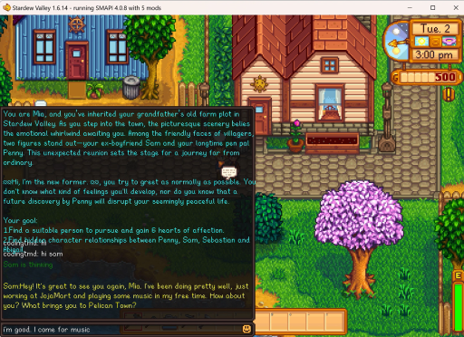
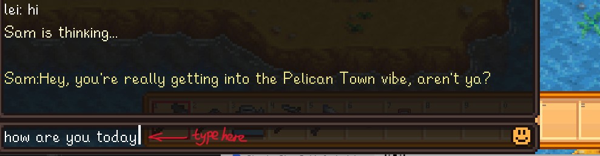

# **Stardew Valley AI** 

This is an AI mod, AI mod, AI mod!

StardewRPG is to demostrate how to enable immersive, **AI-generated** RPG with Stardew Valley NPCs. It works with RPGGO game engine(https://developer.rpggo.ai/dev-docs/introduction/getting-started), which makes to ingest the **soul** into your game much easier!!!!

## 📖 Disclaimer
StardewRPG is primarily a proof of concept. It is not recommended for any business purpose. The license of this repo is MIT, which means you can do anything, and you are responsible for your own behavior.

Have your fun!

## 💖 My Motivation
[Why I build this](https://github.com/codingtmd/stardewAIRPG/wiki)

## 📰 Progress

- Nov 30, 2024: add wiki pages [wiki](https://github.com/codingtmd/stardewAIRPG/wiki)

- Nov 19, 2024: release the [preview version v1.0.6](https://github.com/codingtmd/stardewAIRPG/releases/tag/v1.0.6). Ready for public testing and upload to nexusmods(https://www.nexusmods.com/stardewvalley/mods/29450).
  
- Nov 16, 2024: release the beta version v1.0.0. Lots of bugs :)
  
- Nov 10, 2024: release the alpha testing version. Function to function works. Record a demo video for memroy.

- Oct 20, 2024: the repo created and start the project! We believe this will be very fun.

## ❓ Prerequisites
For general prerequisites for playing with Stardew Valley mods, see the [Player Guide](https://stardewvalleywiki.com/Modding:Player_Guide/Getting_Started) on the Stardew Valley Wiki.

For Q&A of this mod, please see my wiki [Mod Guide](https://github.com/codingtmd/stardewAIRPG/wiki)

## 📽️ Demo

## ⚡️ Getting started
1. Find the latest release of StardewRPG [here](https://github.com/codingtmd/stardewvalley-ai-mod/releases).
1. Download the file titled StardewRPG.zip.
1. Follow the [instructions in the player guide](./instruction%20to%20install%20the%20mod.md) to install the mod.
1. Find your RPGGO key on your [Apply Your Test Key](https://developer.rpggo.ai/dev-docs/support/apply-your-test-key).
1. Start the game with SMAPI and middle-click on a character to initiate an AI-generated conversation.

## 🕹️ How to play
To interact with these AI NPCs, you simply need to find the npc with [bubble💬 on the head],  then press 'R' to open the dialog console, allowing to freely chat and build affect.

