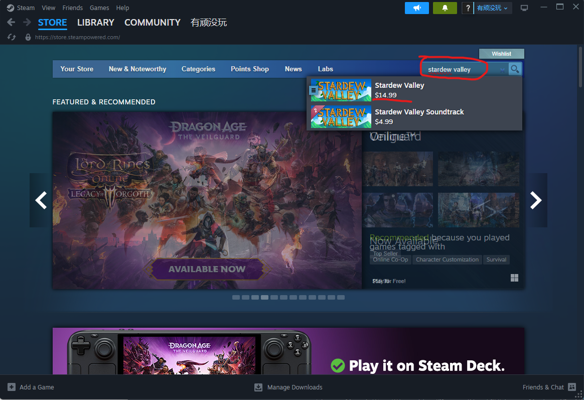
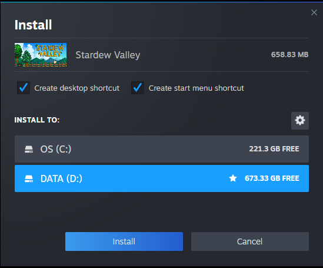
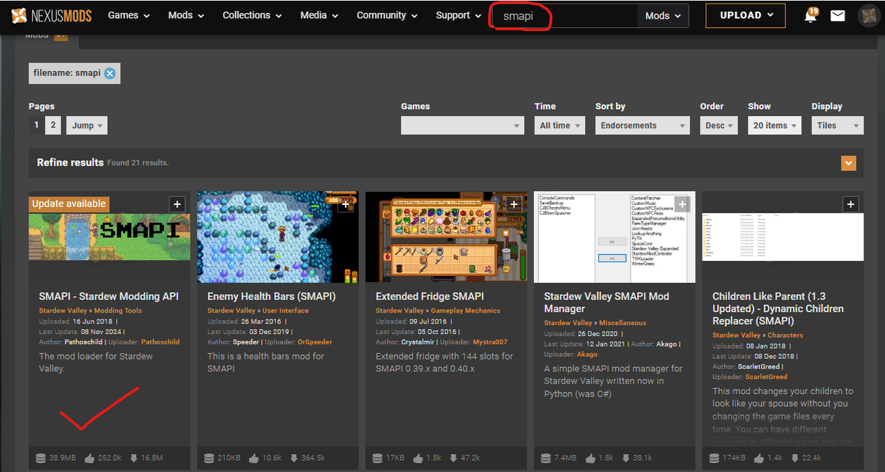

# Step-by-Step Guide for Installing Stardew Valley Mods.

This instruction is to help beginners. Here assumes you have no knowledge of mod.

## Step 1:  Install Stardew Valley game
Of course, you need to have the game before you can install a mod for it!
1. Open your steam and search "stardew valley" in the store. 

2. Pay the money, buy it and wait for 10 mins to download the game to your local PC. 

3. After all the things are done, you will see the game shows up in the left panel of Steam.

## Step 2: Install the Pre-Mods.
In order for our mod to work, you need to install some pre-mods first, like SMAPI.
1. Open https://www.nexusmods.com/ , and search smapi in the search bar.
2. The first one in the result is what you need to install

Enter the mod page and download it by click the "manual" button

3. Unzip the file and choose the installation bash for your pc, windows or macos

4. For example, my computer is windows. I double click "install on Windows.bat", and choose "1"

5. After installation, copy the red line, right click of the stardew valley game, enter the "properties" menu, and paster it in the "launch options" field.

## Step 3: Download and install the AI mod.

Open the Stardew Valley local folder

Copy the unzipped folder into the "Mods" folder.

## Step 4: You done, start your game!
Click the play button in Stardew Valley and enjoy your AI game.

## If you met any error during the setup, read 👇

https://stardewvalleywiki.com/Modding:Player_Guide/Getting_Started#Install_mods